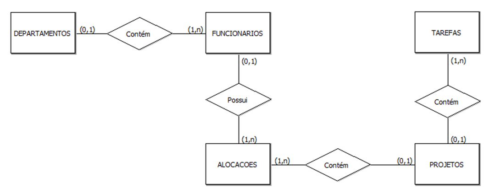

# Projeto de Banco de Dados - Empresa

Este repositório contém o **modelo relacional** e o **script SQL** para criação de um sistema de gerenciamento de:

- Departamentos
- Funcionários
- Projetos
- Alocações (funcionários em projetos)
- Tarefas

---

# Estrutura do Repositório

```
projeto-banco-dados/
│── README.md        # Documentação do projeto
│── script.sql       # Script de criação das tabelas
└── docs/
    └── diagrama.png # Diagrama entidade-relacionamento
```

---

# Modelo Entidade-Relacionamento (MER)

O diagrama abaixo representa as entidades e seus relacionamentos:



---

# Tabelas criadas

- **Departamentos**
- **Funcionarios**
- **Projetos**
- **Alocacoes**
- **Tarefas**

---

# Relações

- Um **departamento** pode ter vários funcionários.
- Um **funcionário** pode estar alocado em vários projetos.
- Uma **alocação** conecta funcionário ↔ projeto.
- Um **projeto** pode ter várias tarefas.
- Cada **tarefa** pertence a exatamente um projeto.

---

# Como usar

1. Clone este repositório:
   ```bash
   git clone https://github.com/LucasPolski/projeto-banco-dados.git
   ```

2. Acesse a pasta do projeto:
   ```bash
   cd projeto-banco-dados
   ```

3. Execute o script no seu SGBD (MySQL, MariaDB, etc.):
   ```sql
   source script.sql;
   ```

---

# Autor
Projeto desenvolvido para estudos de **Modelagem de Dados** e **SQL**.
